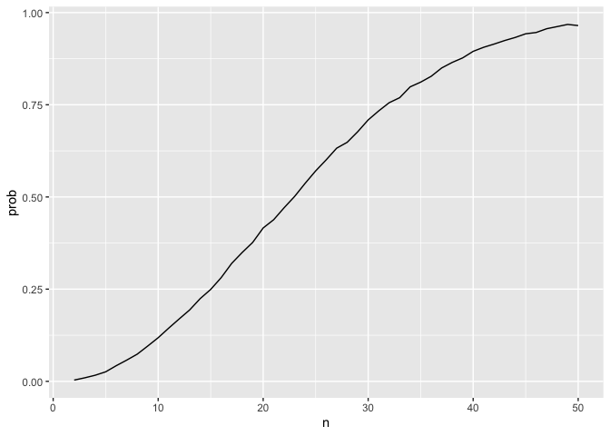
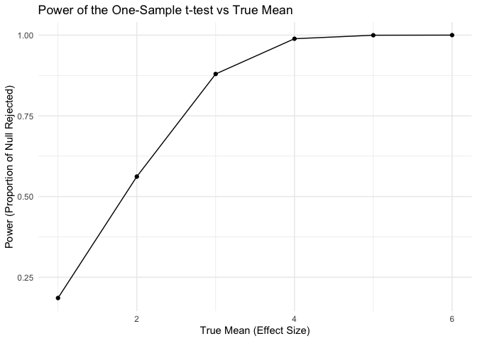

p8105_hw5_az2852
================

``` r
library(tidyverse)
library(rvest)
library(broom)
library(stringr)
```

# Problem 1

Suppose you put n people in a room, and want to know the probability
that at least two people share a birthday. For simplicity, we’ll assume
there are no leap years (i.e. there are only 365 days) and that
birthdays are uniformly distributed over the year (which is actually not
the case).

``` r
set.seed(123)

sample = sample(1:365, size = 10, replace = TRUE)

length(unique(sample)) < 10
```

    ## [1] TRUE

write a function

``` r
bday_sim = function(n) {
  
  sample = sample(1:365, size = n, replace = TRUE)

duplicates = length(unique(sample)) < n

return(duplicates)
}

bday_sim(40)
```

    ## [1] TRUE

run this function 10000 times for each group size between 2 and 50. For
each group size, compute the probability that at least two people in the
group will share a birthday by averaging across the 10000 simulation
runs.

``` r
bday_sim = expand_grid(
    iter = 1:10000,
    n = 2:50) %>% 
  mutate(res = map_lgl(n, bday_sim)) %>% 
  group_by(n) %>% 
  summarize(
    prob = mean(res)
  )
```

Make a plot showing the probability as a function of group size, and
comment on your results.

``` r
ggplot(bday_sim, aes(x = n, y = prob))+
  geom_line()
```

<!-- -->

# Problem 2

When designing an experiment or analysis, a common question is whether
it is likely that a true effect will be detected – put differently,
whether a false null hypothesis will be rejected. The probability that a
false null hypothesis is rejected is referred to as power, and it
depends on several factors, including: the sample size; the effect size;
and the error variance. In this problem, you will conduct a simulation
to explore power in a one-sample t-test.

First set the following design elements:

Fix 𝑛=30 Fix 𝜎=5 Set 𝜇=0 Generate 5000 datasets from the model

𝑥∼𝑁𝑜𝑟𝑚𝑎𝑙\[𝜇,𝜎\]

For each dataset, save 𝜇̂ and the p-value arising from a test of 𝐻:𝜇=0
using 𝛼=0.05

``` r
# write a function that generates a normal vector with n = 30, mean = 0, sd = 5
generate_normal_fixed = function(n = 30, mean = 0, sd = 5) {
  norm_vec = rnorm(n = n, mean = mean, sd = sd)
  return (norm_vec)
}
#check that the function works
generate_normal_fixed()
```

    ##  [1]  -1.50638281  11.24128966  -1.43541777   7.81526558   2.81689408
    ##  [6]   5.27952138   4.41627710  -1.23986513   1.44610737  -5.62958018
    ## [11]   7.06943452  -4.01836495  -5.66102007   0.01833485  -6.47448013
    ## [16]   2.55300023   5.75629956   8.25610248   3.42009145  -2.07792730
    ## [21]  -8.64285139  -1.06919800   1.72571094   1.60057465   1.77494367
    ## [26]  -0.56712096 -10.44907262   2.36263137   2.45046857  -1.28119539

``` r
# Generate 5000 datasets, conduct a t-test for each dataset, save the estimate and p-value
fixed_sim_df = tibble(
  iter = 1:5000,
  data = map(1:5000, ~generate_normal_fixed(n = 30, mean = 0, sd = 5))) %>% 
  mutate(
    t_test_res = map(data, \(x) t.test(x, mu = 0)),
    tidy_res = map(t_test_res, tidy)
  ) %>% 
  unnest(tidy_res) %>%
  select(iter, estimate, p.value)

fixed_sim_df
```

    ## # A tibble: 5,000 × 3
    ##     iter estimate p.value
    ##    <int>    <dbl>   <dbl>
    ##  1     1  -2.01    0.0165
    ##  2     2  -1.12    0.171 
    ##  3     3   0.0709  0.940 
    ##  4     4  -0.370   0.619 
    ##  5     5   0.898   0.313 
    ##  6     6  -0.361   0.691 
    ##  7     7  -0.323   0.727 
    ##  8     8   0.161   0.860 
    ##  9     9  -0.109   0.924 
    ## 10    10   0.0874  0.931 
    ## # ℹ 4,990 more rows

Repeat the above for 𝜇={1,2,3,4,5,6}

``` r
generate_normal = function(n = 30, pop_mean, sd = 5) {
  norm_vec = rnorm(n = n, mean = pop_mean, sd = sd)
  return (norm_vec)
}

sim_df = expand_grid(
    iter = 1:5000,
    pop_mean = c(1,2,3,4,5,6)) %>% 
    mutate(
    data = map(pop_mean, \(x) generate_normal(n = 30, x, sd = 5)),
    t_test_res = map(data, \(x) t.test(x, mu = 0)),
    tidy_res = map(t_test_res, tidy)
  ) %>% 
  unnest(tidy_res) %>% 
  select(iter, pop_mean, estimate, p.value)

sim_df
```

    ## # A tibble: 30,000 × 4
    ##     iter pop_mean estimate     p.value
    ##    <int>    <dbl>    <dbl>       <dbl>
    ##  1     1        1    1.31  0.159      
    ##  2     1        2    1.41  0.156      
    ##  3     1        3    2.27  0.0111     
    ##  4     1        4    3.38  0.000575   
    ##  5     1        5    5.35  0.00000154 
    ##  6     1        6    6.32  0.000000256
    ##  7     2        1    1.61  0.0621     
    ##  8     2        2    0.983 0.150      
    ##  9     2        3    4.69  0.00000328 
    ## 10     2        4    5.24  0.0000496  
    ## # ℹ 29,990 more rows

Make a plot showing the proportion of times the null was rejected (the
power of the test) on the y axis and the true value of 𝜇on the x axis.
Describe the association between effect size and power.

``` r
# Calculate the power (proportion of p-values < 0.05) for each true mean
power_df = sim_df %>%
  group_by(pop_mean) %>%
  summarize(power = mean(p.value < 0.05))

# Plot the power against the true mean (effect size)
power_df %>%
  ggplot(aes(x = pop_mean, y = power)) +
  geom_line() +
  geom_point() +
  labs(
    title = "Power of the One-Sample t-test vs True Mean",
    x = "True Mean (Effect Size)",
    y = "Power (Proportion of Null Rejected)"
  ) +
  theme_minimal()
```

<!-- -->

Power increases as effect size (true mean mu) increases. When the true
mean is close to 0, the power is low (close to the significance level of
0.05). As true mean increases, power approaches 1. The increase in power
appears to be sharp at first and then slows down as power gets close to
1.

Make a plot showing the average estimate of 𝜇̂ on the y axis and the true
value of 𝜇on the x axis. Make a second plot (or overlay on the first)
the average estimate of 𝜇̂ only in samples for which the null was
rejected on the y axis and the true value of 𝜇on the x axis. Is the
sample average of 𝜇̂ across tests for which the null is rejected
approximately equal to the true value of 𝜇? Why or why not?

``` r
# calculate average estimates for all samples and for samples where null was rejected
summary_df = sim_df %>%
  group_by(pop_mean) %>%
  summarize(
    avg_estimate_all = mean(estimate),
    avg_estimate_rejected = mean(estimate[p.value < 0.05])
  )

#plot average estimate against the true mean for all and rejected samples
ggplot(summary_df, aes(x = pop_mean)) +
  geom_line(aes(y = avg_estimate_all, color = "All Samples"), size = 1) +
  geom_point(aes(y = avg_estimate_all, color = "All Samples")) +
  geom_line(aes(y = avg_estimate_rejected, color = "Rejected Samples"), size = 1, linetype = "dashed") +
  geom_point(aes(y = avg_estimate_rejected, color = "Rejected Samples")) +
  labs(
    title = "Average Estimate of the Mean vs True Mean",
    x = "True Mean (mu)",
    y = "Average Estimate (mu_hat)",
    color = "Legend"
  ) +
  theme_minimal()
```

    ## Warning: Using `size` aesthetic for lines was deprecated in ggplot2 3.4.0.
    ## ℹ Please use `linewidth` instead.
    ## This warning is displayed once every 8 hours.
    ## Call `lifecycle::last_lifecycle_warnings()` to see where this warning was
    ## generated.

<!-- -->

The average estimate mu_hat for which the null is rejected is not
approximately equal to the true mean. Rather, the average estimates for
rejected samples are higher because only samples with larger estimates
(further from 0) are more likely to reject the null hypothesis.

# Problem 3

``` r
# load the homicide data
homicide_raw_df = read_csv("data/homicide-data.csv", na = c("Unknown"))
```

    ## Warning: One or more parsing issues, call `problems()` on your data frame for details,
    ## e.g.:
    ##   dat <- vroom(...)
    ##   problems(dat)

    ## Rows: 52179 Columns: 12
    ## ── Column specification ────────────────────────────────────────────────────────
    ## Delimiter: ","
    ## chr (8): uid, victim_last, victim_first, victim_race, victim_sex, city, stat...
    ## dbl (4): reported_date, victim_age, lat, lon
    ## 
    ## ℹ Use `spec()` to retrieve the full column specification for this data.
    ## ℹ Specify the column types or set `show_col_types = FALSE` to quiet this message.

``` r
# check for missing data
sum(is.na(homicide_raw_df))
```

    ## [1] 23075

``` r
summary(homicide_raw_df)
```

    ##      uid            reported_date       victim_last        victim_first      
    ##  Length:52179       Min.   : 20070101   Length:52179       Length:52179      
    ##  Class :character   1st Qu.: 20100318   Class :character   Class :character  
    ##  Mode  :character   Median : 20121216   Mode  :character   Mode  :character  
    ##                     Mean   : 20130899                                        
    ##                     3rd Qu.: 20150911                                        
    ##                     Max.   :201511105                                        
    ##                                                                              
    ##  victim_race          victim_age     victim_sex            city          
    ##  Length:52179       Min.   :  0.0   Length:52179       Length:52179      
    ##  Class :character   1st Qu.: 22.0   Class :character   Class :character  
    ##  Mode  :character   Median : 28.0   Mode  :character   Mode  :character  
    ##                     Mean   : 31.8                                        
    ##                     3rd Qu.: 40.0                                        
    ##                     Max.   :102.0                                        
    ##                     NA's   :2999                                         
    ##     state                lat             lon          disposition       
    ##  Length:52179       Min.   :25.73   Min.   :-122.51   Length:52179      
    ##  Class :character   1st Qu.:33.77   1st Qu.: -96.00   Class :character  
    ##  Mode  :character   Median :38.52   Median : -87.71   Mode  :character  
    ##                     Mean   :37.03   Mean   : -91.47                     
    ##                     3rd Qu.:40.03   3rd Qu.: -81.76                     
    ##                     Max.   :45.05   Max.   : -71.01                     
    ##                     NA's   :60      NA's   :60

The original data contains 52179 rows and 12 columns. Important
variables include reported date (dbl), victim’s first and last name
(chr), victim_race (chr), victim_age (dbl), victim_sex (chr), city
(chr), state (chr), latitude and longitude (dbl), and disposition (chr).
There is a considerable amount of data missing in the columns of victim
name, race, age, and sex, especially for cities Dallas, Los Angeles, and
Sacramento.

#### Create a city_state variable (e.g. “Baltimore, MD”) and then summarize within cities to obtain the total number of homicides and the number of unsolved homicides (those for which the disposition is “Closed without arrest” or “Open/No arrest”).

``` r
#create a city_state variable
homicide_df = homicide_raw_df %>%
  mutate(city_state = str_c(city, state, sep = ", "))

# Summarizing homicides within each city
homicide_df %>%
  group_by(city_state) %>%
  summarize(
    total_homicides = n(),
    unsolved_homicides = sum(disposition %in% c("Closed without arrest", "Open/No arrest"))
  )
```

    ## # A tibble: 51 × 3
    ##    city_state      total_homicides unsolved_homicides
    ##    <chr>                     <int>              <int>
    ##  1 Albuquerque, NM             378                146
    ##  2 Atlanta, GA                 973                373
    ##  3 Baltimore, MD              2827               1825
    ##  4 Baton Rouge, LA             424                196
    ##  5 Birmingham, AL              800                347
    ##  6 Boston, MA                  614                310
    ##  7 Buffalo, NY                 521                319
    ##  8 Charlotte, NC               687                206
    ##  9 Chicago, IL                5535               4073
    ## 10 Cincinnati, OH              694                309
    ## # ℹ 41 more rows

#### For the city of Baltimore, MD, use the prop.test function to estimate the proportion of homicides that are unsolved; save the output of prop.test as an R object, apply the broom::tidy to this object and pull the estimated proportion and confidence intervals from the resulting tidy dataframe.

``` r
# Subset data for Baltimore, MD
baltimore_data = homicide_df %>%
  filter(city_state == "Baltimore, MD")

# Calculate the number of unsolved homicides and total homicides
unsolved_baltimore = baltimore_data %>% 
  filter(disposition %in% c("Closed without arrest", "Open/No arrest")) %>%
  nrow()

total_baltimore = nrow(baltimore_data)

# conduct proportion test and save the result as an r object
prop_test_baltimore = prop.test(unsolved_baltimore, total_baltimore)

# Tidy the result & extract estimated proportion and CI
tidy(prop_test_baltimore) %>% 
  select(estimate, conf.low, conf.high)
```

    ## # A tibble: 1 × 3
    ##   estimate conf.low conf.high
    ##      <dbl>    <dbl>     <dbl>
    ## 1    0.646    0.628     0.663

#### Run prop.test for each of the cities in your dataset, and extract both the proportion of unsolved homicides and the confidence interval for each. Do this within a “tidy” pipeline, making use of purrr::map, purrr::map2, list columns and unnest as necessary to create a tidy dataframe with estimated proportions and CIs for each city.

``` r
# For each city, calculate the number of unsolved homicides and total homicides, conduct proportion test, and extract estimated proportions and CIs
results_df = 
homicide_df %>%
  group_by(city_state) %>%
  summarize(
    total_homicides = n(),
    unsolved_homicides = sum(disposition %in% c("Closed without arrest", "Open/No arrest"))
  ) %>%
  mutate(
    prop_test_res = map2(unsolved_homicides, total_homicides, ~prop.test(.x, .y)),
    tidy_res = map(prop_test_res, tidy)
  ) %>%
  unnest(tidy_res) %>%
  select(city_state, estimate, conf.low, conf.high)
```

    ## Warning: There was 1 warning in `mutate()`.
    ## ℹ In argument: `prop_test_res = map2(unsolved_homicides, total_homicides,
    ##   ~prop.test(.x, .y))`.
    ## Caused by warning in `prop.test()`:
    ## ! Chi-squared approximation may be incorrect

``` r
results_df
```

    ## # A tibble: 51 × 4
    ##    city_state      estimate conf.low conf.high
    ##    <chr>              <dbl>    <dbl>     <dbl>
    ##  1 Albuquerque, NM    0.386    0.337     0.438
    ##  2 Atlanta, GA        0.383    0.353     0.415
    ##  3 Baltimore, MD      0.646    0.628     0.663
    ##  4 Baton Rouge, LA    0.462    0.414     0.511
    ##  5 Birmingham, AL     0.434    0.399     0.469
    ##  6 Boston, MA         0.505    0.465     0.545
    ##  7 Buffalo, NY        0.612    0.569     0.654
    ##  8 Charlotte, NC      0.300    0.266     0.336
    ##  9 Chicago, IL        0.736    0.724     0.747
    ## 10 Cincinnati, OH     0.445    0.408     0.483
    ## # ℹ 41 more rows

#### Create a plot that shows the estimates and CIs for each city – check out geom_errorbar for a way to add error bars based on the upper and lower limits. Organize cities according to the proportion of unsolved homicides.

``` r
ggplot(results_df, aes(x = reorder(city_state, estimate), y = estimate)) +
  geom_point(color = "blue", size = 2) +  
  geom_errorbar(aes(ymin = conf.low, ymax = conf.high), width = 0.2) +  
  labs(
    x = "City",
    y = "Estimated Proportion of Unsolved Homicides",
    title = "Estimated Proportion of Unsolved Homicides with 95% CI"
  ) +
  theme(axis.text.x = element_text(angle = 90, hjust = 1)) +  
  coord_flip()
```

<!-- -->

``` r
ggsave("homicide_plot.png", height = 8, width = 8, units = "in")
```

``` r
#checking why Tulsa, AL has estimated proportion of 0
homicide_df %>% 
  filter(city_state == "Tulsa, AL") %>% 
  filter(!disposition %in% c("Closed without arrest", "Open/No arrest"))
```

    ## # A tibble: 1 × 13
    ##   uid   reported_date victim_last victim_first victim_race victim_age victim_sex
    ##   <chr>         <dbl> <chr>       <chr>        <chr>            <dbl> <chr>     
    ## 1 Tul-…      20160930 HARRIS      LESLIE       White               41 Female    
    ## # ℹ 6 more variables: city <chr>, state <chr>, lat <dbl>, lon <dbl>,
    ## #   disposition <chr>, city_state <chr>

There is only one entry for Tulsa, AL, causing the estimate to be 0.
